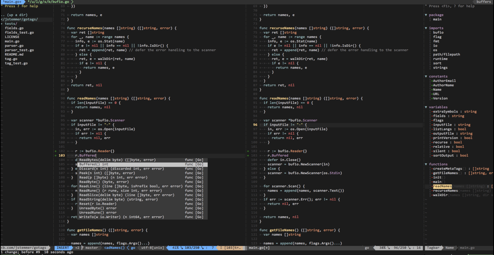

dotfiles support nvim
========

--------

## 安装


 ### 安装 nvim
 ```bash
 curl -L https://raw.githubusercontent.com/khalily/dotfiles/master/install.sh | bash
 ```

 ### clone nvim 配置
 ```bash
 git clone https://github.com/khalily/dotfiles ~/.config/nvim
 ```

 ### tmux 配置
 ```bash
 ln -sf ~/.config/nvim/tmux.conf ~/.tmux.conf
 ln -sf ~/.config/nvim/tmux-statusline-color.conf ~/.tmux-statusline-color.conf
 ```

 ### 安装字体
 ```bash
 打开 fonts/consola.ttf 安装，并在终端中设置字体为 consola
 ```

## nvim 快捷键

以下是部分快捷键，更详细的快捷键请查阅 init.vim

| 快捷键       | 说明                                 |
| -------      | -----                                |
| `,`          | Leader Key                           |
| `<leader>n`  | 打开/关闭代码资源管理器              |
| `<leader>t`  | 打开/关闭函数列表                    |
| `<leader>ev` | 编辑 init.vim                        |
| `<leader>sv` | 加载 init.vim                        |
| `<leader>y`  | 打印当前文件名                       |
| `<leader>-`  | 水平分割当前窗口                     |
| `<leader>v`  | 垂直分割当前窗口                     |
| `<leader>f`  | 搜索当前光标下的单词                 |
| `/`          | 在当前窗口中搜索文本                 |
| `<leader>/`  | 取消高亮当前搜索文本                 |
| `<leader>q`  | 强制退出当前窗口                     |
| `<Ctrl>j`    | 向下移动窗口                         |
| `<Ctrl>k`    | 向上移动窗口                         |
| `<Ctrl>h`    | 向左移动窗口                         |
| `<Ctrl>l`    | 向右移动窗口                         |
| `<Ctrl>u`    | 向上滚动窗口                         |
| `<Ctrl>d`    | 向下滚动窗口                         |
| `<Ctrl>r`    | 打开函数签名跳转列表                 |
| `<Ctrl>p`    | 打开文件搜索列表                     |
| `<Ctrl>]`    | 转到函数定义                         |
| `<Ctrl>o`    | 向后跳转                             |
| `<Ctrl>i`    | 向前跳转                             |
| `u`          | 撤销更改(undo)                       |
| `U`          | 恢复上一次操作(redo)                 |
| `;`          | `:`                                  |
| `<F2>`       | 显示/关闭行号                        |
| `<F5>`       | 显示/关闭 Undo Tree                  |

## tmux 快捷键

| 快捷键	       | 说明                                 |
| -------	       | -----                                |
| `<Ctrl>a`	       | Prefix Key                           |
| `<Prefix>c`	       | 创建新窗口              	      |
| `<Prefix><Ctrl>a`    | 回到上一个窗口                       |
| `<Prefix>-`	       | 水平分割窗口                         |
| `<Prefix>\|`	       | 垂直分割窗口                         |
| `<Prefix>[`	       | 像vim一样操作当前窗口                |
| `<Ctrl>j`	       | 向下移动窗口                         |
| `<Ctrl>k`	       | 向上移动窗口                         |
| `<Ctrl>l`	       | 向右移动窗口                         |
| `<Ctrl>h`	       | 向左移动窗口                         |
