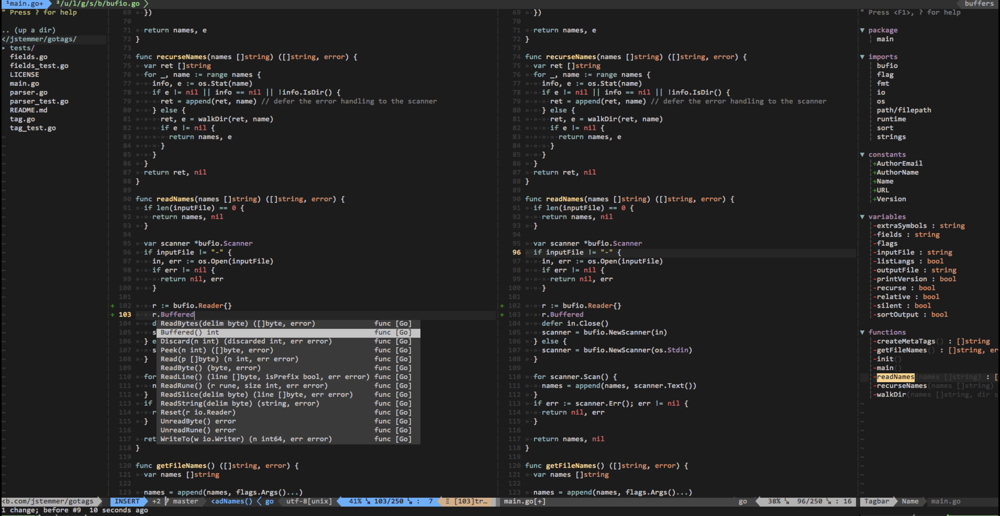

dotfiles support nvim
========

--------

## 安装

### 一键安装

```bash
git clone https://github.com/khalily/dotfiles ~/.config/nvim
cd ~/.config/nvim
./install.sh
```

安装完成后重启 shell 或执行:
```bash
source ~/.bashrc   # bash 用户
# 或
source ~/.zshrc    # zsh 用户
```

### 手动安装步骤

#### 1. clone 配置
```bash
git clone https://github.com/khalily/dotfiles ~/.config/nvim
```

#### 2. 运行安装脚本
```bash
cd ~/.config/nvim
./install.sh
```

#### 3. tmux 配置
```bash
ln -sf ~/.config/nvim/tmux.conf ~/.tmux.conf
```

#### 4. 安装字体
```bash
打开 fonts/consola.ttf 安装，并在终端中设置字体为 consola
```

#### 5. 打开 nvim 稍等片刻，等待插件安装完毕即可使用

### 卸载

```bash
cd ~/.config/nvim
./uninstall.sh
```

### 环境变量

| 变量 | 说明 | 默认值 |
|------|------|--------|
| `NVIM_VERSION` | Neovim 版本/分支 | `master` |
| `NVIM_MIRROR` | Neovim 下载镜像 | GitHub |

示例:
```bash
export NVIM_VERSION="v0.9.5"
./install.sh
```

### 安装内容

| 组件 | 版本 | 安装方式 | 位置 |
|------|------|----------|------|
| CMake | 3.28.1+ | 预编译二进制 | `~/.cmake` |
| Neovim | master/v0.9.5+ | 源码编译 | `~/.nvim` |
| Tmux | 3.5a+ | 源码编译 | `~/.tmux` |
| Pyenv | latest | git clone | `~/.pyenv` |

**注意**: 安装脚本会跳过 apt-get 安装 nvim/tmux/pyenv，优先使用本地编译/下载的版本。

## nvim 快捷键

以下是部分快捷键，更详细的快捷键请查阅 init.vim

| 快捷键       | 说明                                 |
| -------      | -----                                |
| `,`          | Leader Key                           |
| `<leader>n`  | 打开/关闭代码资源管理器              |
| `<leader>t`  | 打开/关闭函数列表                    |
| `<leader>ev` | 编辑 init.vim                        |
| `<leader>sv` | 加载 init.vim                        |
| `<leader>y`  | 打印当前文件名                       |
| `<leader>-`  | 水平分割当前窗口                     |
| `<leader>v`  | 垂直分割当前窗口                     |
| `<leader>f`  | 搜索当前光标下的单词                 |
| `/`          | 在当前窗口中搜索文本                 |
| `<leader>/`  | 取消高亮当前搜索文本                 |
| `<leader>q`  | 强制退出当前窗口                     |
| `<Ctrl>j`    | 向下移动窗口                         |
| `<Ctrl>k`    | 向上移动窗口                         |
| `<Ctrl>h`    | 向左移动窗口                         |
| `<Ctrl>l`    | 向右移动窗口                         |
| `<Ctrl>u`    | 向上滚动窗口                         |
| `<Ctrl>d`    | 向下滚动窗口                         |
| `<Ctrl>r`    | 打开函数签名跳转列表                 |
| `<Ctrl>p`    | 打开文件搜索列表                     |
| `<Ctrl>]`    | 转到函数定义                         |
| `<Ctrl>o`    | 向后跳转                             |
| `<Ctrl>i`    | 向前跳转                             |
| `u`          | 撤销更改(undo)                       |
| `U`          | 恢复上一次操作(redo)                 |
| `;`          | `:`                                  |
| `<F2>`       | 显示/关闭行号                        |
| `<F5>`       | 显示/关闭 Undo Tree                  |

## tmux 快捷键

| 快捷键	       | 说明                                 |
| -------	       | -----                                |
| `<Ctrl>a`	       | Prefix Key                           |
| `<Prefix>c`	   | 创建新窗口              	      |
| `<Prefix><Ctrl>a` | 回到上一个窗口                       |
| `<Prefix>-`	   | 水平分割窗口                         |
| `<Prefix>\|`	   | 垂直分割窗口                         |
| `<Prefix>[`	   | 像vim一样操作当前窗口                |
| `<Ctrl>j`	       | 向下移动窗口                         |
| `<Ctrl>k`	       | 向上移动窗口                         |
| `<Ctrl>l`	       | 向右移动窗口                         |
| `<Ctrl>h`	       | 向左移动窗口                         |

